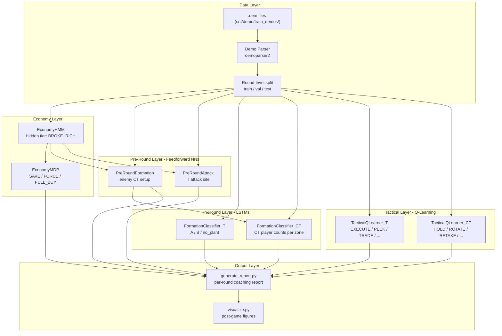
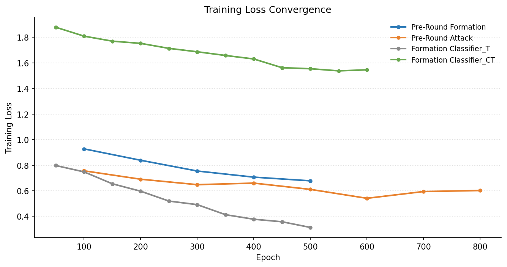
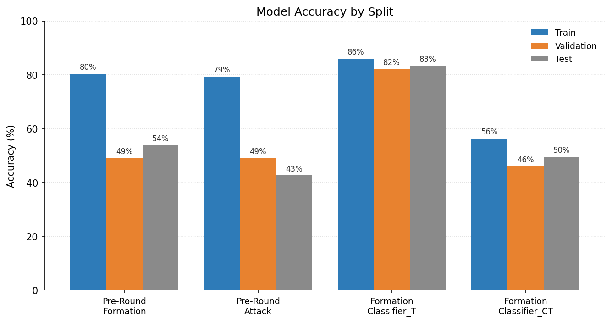
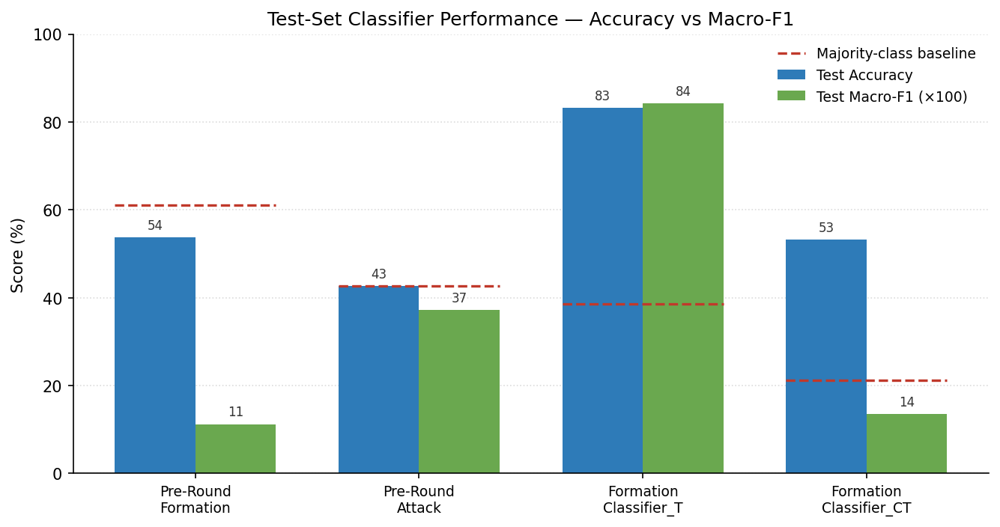
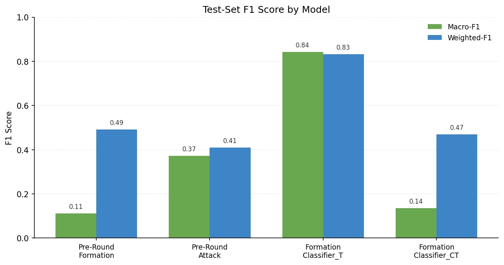
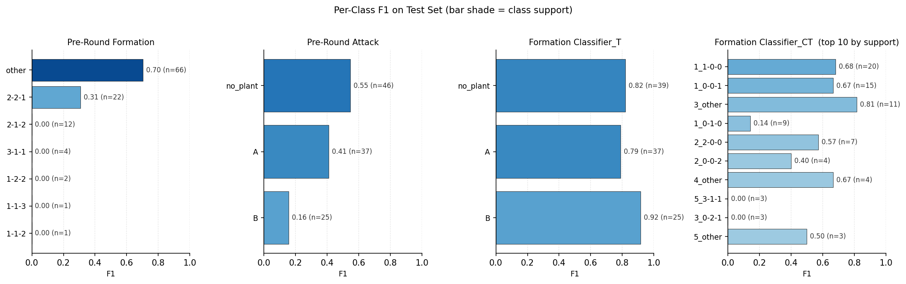
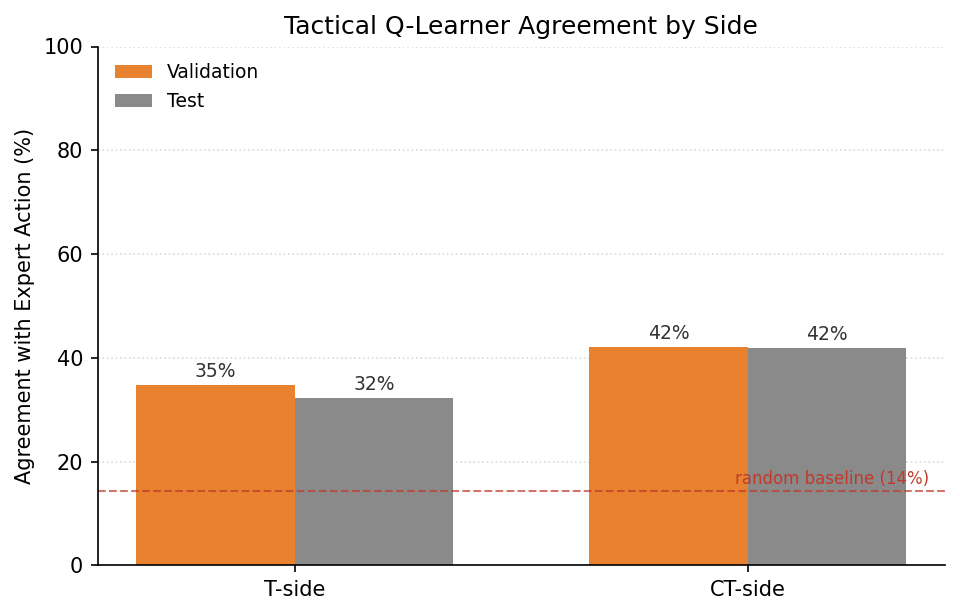

# CS2 AI Coaching — Technical Report

This is the main technical reference for the project. The system ingests
Counter-Strike 2 demo files (`.dem`), runs a chain of probabilistic and
learned models over them, and emits a structured per-round coaching
report for one target player.

The full model inventory and per-module details are split across a set
of linked sub-documents:

- [HMM — Enemy Economy Prediction](models/hmm.md)
- [MDP — Buy Decision Evaluation](models/economy_mdp.md)
- [Pre-Round Formation FNN (CT setup)](models/preround_formation.md)
- [Pre-Round Attack FNN (T attack site)](models/preround_attack.md)
- [Formation Classifier_T — T attack LSTM](models/formation_classifier_t.md)
- [Formation Classifier_CT — CT formation LSTM](models/formation_classifier_ct.md)
- [Tactical Q-Learning — T + CT](models/qlearning.md)

Supporting pipeline components:

- [Demo Parser](pipeline/demo_parser.md)
- [Training-Data Extraction & Splits](pipeline/training_data.md)
- [Report Generation & Visualization](pipeline/report_generation.md)

---

## 1. Pipeline



**Design principle.** Formation models answer "where are the enemies
and what are they doing?" — Q-learners answer "what should I do about
it?". They feed independent information into the final report.

**Side-specific routing in the report.** A T-side player sees the
pre-round CT-setup prediction (PreRoundFormation) and the in-round
CT-formation evolution (FormationClassifier_CT), plus the T-side
Q-learner. A CT-side player sees the pre-round T-attack prediction
(PreRoundAttack) and the in-round T-attack estimate
(FormationClassifier_T), plus the CT-side Q-learner.

---

## 2. Expected Output

The end-to-end command is:

```bash
python src/report/generate_report.py <demo.dem> <player_name>
```

A round block from a generated report looks like this (shortened):

```
R5 [CT] W  K:2 D:0 DMG:167
  -- Pre-Round (Economy + Formation) --
  [HMM]          Enemy ~$4230 (FORCE buy, 49% confidence)
  [MDP]          Good buy (FULL_BUY at $5500). Waste: $0
  [NN attack]    T-side likely hitting A (67%) vs B (33%)

  -- Event Timeline --
  [ 8.1s] T smoke @ MID
          [LSTM]  T leaning B (55%)
          [RL_CT] HOLD -- Hold position, wait for contact
  [14.2s] T kills CT @ B
          [LSTM]  T attacking B (88%)
          [RL_CT] ROTATE -- Rotate toward B
  [25.6s] Bomb planted B
          [RL_CT] RETAKE -- Group for retake

  -- Outcome --
  >> Round won. 2K / 167 DMG.
```

Alongside the text report, the system emits a JSON report (machine
readable), and a set of per-match figures to `reports/`:

- `kill_heatmap.png`
- `utility_usage.png`
- `economy_flow.png`
- `win_rate_by_side.png`
- `attack_by_tier.png`
- `preround_formation.png`
- `ql_coverage.png`
- `lstm_accuracy.png`

The training-time figures (used in the analysis below) live alongside
these:

- `training_accuracy.png`
- `training_loss_curves.png`
- `classifier_metrics.png`
- `f1_scores.png`
- `f1_per_class.png`
- `qlearner_agreement.png`

---

## 3. Numerical Analysis

All figures below are generated automatically by
`python src/report/training_charts.py`, which reads
`data/training_results.json` and emits PNGs into `reports/`.

### 3.1 Dataset

The dataset is built by parsing every demo in
`src/demo/train_demos/` (35 Mirage demos, see
[Training-Data Extraction & Splits](pipeline/training_data.md) for
the full list of sources and the feature schema). Knife rounds are
dropped; official rounds are pooled across all demos and split
**by round**, not by demo, into 70% / 15% / 15% train / val / test.

| Split | Rounds | Sequences (T LSTM) | Sequences (CT LSTM) |
|---:|---:|---:|---:|
| Train | 720 | 499 | 441 |
| Val   | 108 | 108 | 100 |
| Test  | 108 | 101 |  94 |

### 3.2 Training Curves



Every model was trained with Adam, cosine-annealed early stopping,
and `ReduceLROnPlateau`. Loss curves are sparsely sampled because
the training loop prints every 50-100 epochs; full per-epoch
histories are persisted under `nn.<model>.train.loss_history` in
`data/training_results.json` from the next retrain forward.

### 3.3 Test-Set Accuracy vs Majority Baseline




### 3.4 F1 Scores




| Model | Test Acc | Macro-F1 | Weighted-F1 | Majority baseline |
|---|---:|---:|---:|---:|
| [Pre-Round Formation](models/preround_formation.md) | 53.7% | 0.112 | 0.492 | 61.1% |
| [Pre-Round Attack](models/preround_attack.md) | 42.6% | 0.372 | 0.410 | 42.6% |
| [Formation Classifier_T](models/formation_classifier_t.md) | **83.2%** | **0.842** | 0.833 | 38.6% |
| [Formation Classifier_CT](models/formation_classifier_ct.md) | 53.2% | 0.136 | 0.469 | 21.3% |

**Reading the numbers.**

- `FormationClassifier_T` is the strongest model by every metric.
  Macro-F1 (0.84) is within 0.01 of Accuracy (0.83), meaning the model
  performs comparably across all three classes rather than collapsing
  to the majority. Its accuracy is **2.2× the majority-class baseline**.
- `FormationClassifier_CT` posts 2.5× the majority baseline in accuracy
  (53.2% vs 21.3%), but macro-F1 of 0.14 reveals that this lift comes
  from the two dominant stacks (`1-1-0-0`, `1-0-0-1`) while rare
  formations (e.g. `0-1-0` post-trade) are under-predicted. The model
  is useful but the per-class breakdown is honest about where it fails.
- `PreRoundFormation` posts test accuracy (53.7%) **below** the
  majority-class baseline (61.1%), with macro-F1 of 0.11. This is a
  genuine finding: pre-round economy + prior-round tendencies do not
  contain enough signal to resolve 9-class CT formation on this dataset.
  See [preround_formation.md](models/preround_formation.md#53-why-below-baseline)
  for discussion.
- `PreRoundAttack` matches the majority baseline on accuracy but its
  macro-F1 of 0.37 indicates real per-class learning across A / B /
  no_plant rather than collapse into one class.

### 3.5 Tactical Q-Learner Agreement



| Q-learner | Val agreement | Test agreement | State coverage | SA pairs |
|---|---:|---:|---:|---:|
| T-side  | 34.8% | 32.3% | 16.2% | 2 144 |
| CT-side | 42.0% | 41.9% | 17.6% | 2 483 |

Random-policy agreement in a 7-action space is ≈ 14.3%. Both learners
clear that by **2.3× (T) and 2.9× (CT)** on held-out data. The CT side
is the stronger of the two because CT behavior (hold / rotate / retake)
is more structured and repeatable than T execute patterns, which
concentrates expert actions into fewer equivalent states.

### 3.6 Limitations & Future Work

Taken as a whole, the numerical results support two conclusions.

**What works.** Event-driven LSTM classification is the right tool for
the part of the problem that has a rich in-round signal: the T attack
LSTM turns a sequence of kills, utility throws and plants into a
confident A/B/no_plant prediction with high per-class F1. Similarly,
the tabular Q-learners learn a reasonable policy from demo data
without heroic sample sizes.

**What doesn't (yet).** Pre-round prediction from economy + prior-round
tendencies is the weakest link. Accuracy below the majority baseline
on `PreRoundFormation` is the clearest signal we have that the 9-class
CT-formation target is under-determined by the available features.
Two directions are natural next steps:

1. **Richer pre-round features.** Side-level utility loadout, spawn
   positions and individual-player preferences (is this AWPer usually
   on A or B?) are all observable pre-round and should carry
   meaningful signal. Only CS-agnostic features are used today.
2. **More training demos.** All four classifiers are training on
   fewer than 800 rounds. The CT-formation target in particular
   has 30+ alive-aware classes, so per-class support on the tail
   is in the single digits. The model isn't overfitting in the
   classical sense (train vs test gap is small on the LSTMs), but
   it's under-exposed to rare formations.
3. **Soft labels.** Many rounds genuinely have two plausible setups
   (2-1-2 vs 2-2-1 on `other`). A soft-target / top-k objective may be
   a better fit than single-label cross-entropy for the formation
   task.

These are consistent with the project's scope and level: this is an
undergraduate project in an under-studied domain (tactical esports
coaching is not a classical CS domain), and the main deliverable is
the full pipeline and the coaching report, not a state-of-the-art
classifier. The numbers tell the reader which components to trust
and which to treat as exploratory.

---

## 4. How to Reproduce

```bash
python src/analysis/train_pipeline.py extract   
python src/analysis/train_pipeline.py train     
python src/analysis/metrics.py                  
python src/report/training_charts.py            
python src/report/generate_report.py <demo.dem> <player_name>  
```

Everything the report depends on (trained models, split CSVs,
`training_results.json`) lives under `models/` and `data/` in the
repository.
